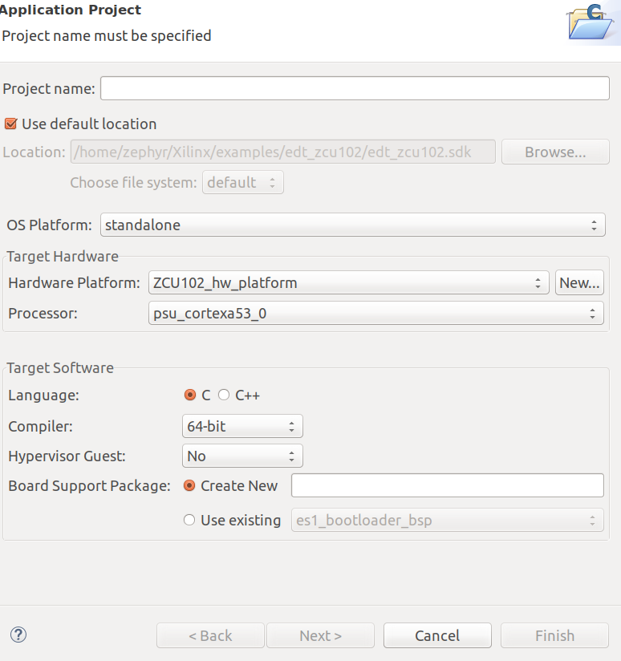
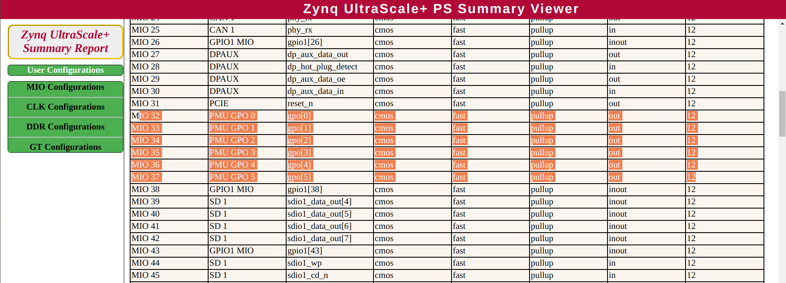
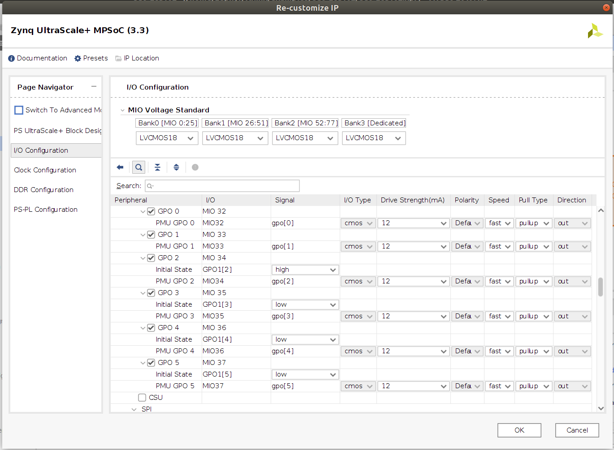
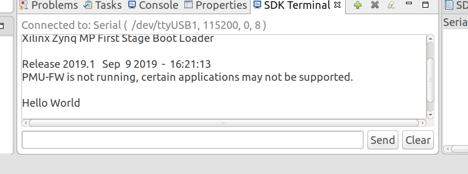
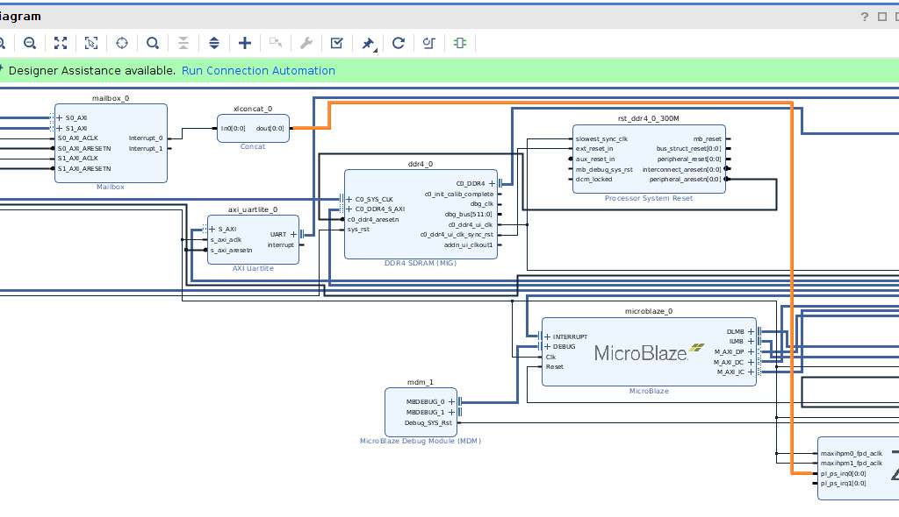
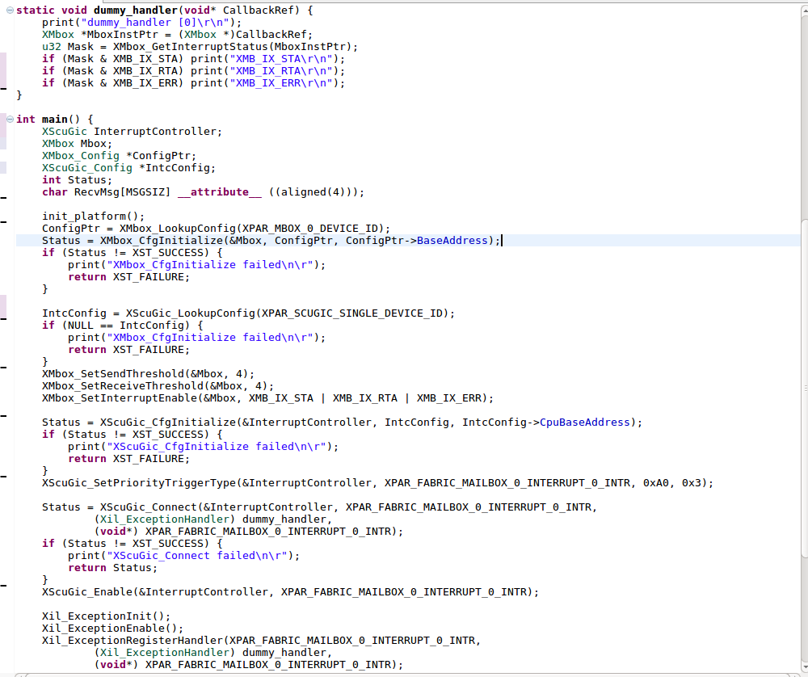
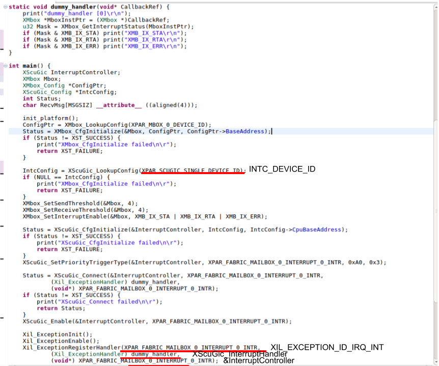

# Xilinx ZCU102 debug notes

MIT License

Copyright (c) 2019 Zephyr Yao

Permission is hereby granted, free of charge, to any person obtaining a copy
of this software and associated documentation files (the "Software"), to deal
in the Software without restriction, including without limitation the rights
to use, copy, modify, merge, publish, distribute, sublicense, and/or sell
copies of the Software, and to permit persons to whom the Software is
furnished to do so, subject to the following conditions:

The above copyright notice and this permission notice shall be included in all
copies or substantial portions of the Software.

THE SOFTWARE IS PROVIDED "AS IS", WITHOUT WARRANTY OF ANY KIND, EXPRESS OR
IMPLIED, INCLUDING BUT NOT LIMITED TO THE WARRANTIES OF MERCHANTABILITY,
FITNESS FOR A PARTICULAR PURPOSE AND NONINFRINGEMENT. IN NO EVENT SHALL THE
AUTHORS OR COPYRIGHT HOLDERS BE LIABLE FOR ANY CLAIM, DAMAGES OR OTHER
LIABILITY, WHETHER IN AN ACTION OF CONTRACT, TORT OR OTHERWISE, ARISING FROM,
OUT OF OR IN CONNECTION WITH THE SOFTWARE OR THE USE OR OTHER DEALINGS IN THE
SOFTWARE.

## Problem with PL helloworld and the board config fix

The ZYNQ UltraScale+ ZCU102 is a cool FPGA board with a Cortex-A53 and a Cortex-R5. It is my first time to set my hands to an FPGA board. I started with a tutorial, https://www.xilinx.com/support/documentation/sw_manuals/xilinx2019_1/ug1209-embedded-design-tutorial.pdf, which guides through generating hardware layout with Xilinx Vivado (not PL), running a simple bootloader and helloworld program, and then building and running a Linux (on the Cortex hard cores). Our software versions are Ubuntu 18.04.3, Xilinx Vivado 2019.1.2, and Xilinx SDK 2019.1.

Unfortunately, there is no print on the serial terminal, even I follow the tutorial Chapter 2 step by step. My labmate, Seyed Mohammadjavad Seyed Talebi, repeated the tutorial and had the same results. We began to look for solutions online and found these forum questions, https://forums.xilinx.com/t5/Evaluation-Boards/Hello-World-on-Zynq-Ultrascale/td-p/953650, https://forums.xilinx.com/t5/Evaluation-Boards/Hello-World-on-ZCU102/td-p/959547, and these patches https://www.xilinx.com/support/answers/71961.html, https://www.xilinx.com/support/answers/72113.html. As the forum suggests, we tried to first create and run a First Stage Boot Loader, and then run the helloworld application without `psu_init.tcl`, all using the predefined ZCU102_hw_platform rather than the one we built with Vivado. Now the helloworld works.

First of all, I applied a fix due to the DDR chip change to this newer version of the board: https://forums.xilinx.com/t5/Xilinx-Evaluation-Boards/ZCU102-debug-failure-on-new-board/td-p/943375. The problem remains. The hardware platform that we generated with Vivado (Board ZCU102 v3.3) still does not work. The forum answers do not seem to solve the problem. I decided to take a look at the hardware platform folder. The folder consists of a couple of giant c and header files and a binary hardware layout file. I attempted to `diff -r` the predefined folder and the one we generated with Vivado, but there are too many differences in the code, including many address differences, which doesn't matter. I did not know how to diff the binary layout file, but I found there is a html summary file showing the hardware setups in a readable format. I diffed the file and found the root cause of the problem! The predefined hardware platform has PMU GPO 0 - PMU GPO 5 enabled, but our build only has PMU GPO 2 enabled. 

"PMU GPOs are used for sending signals to power supplies and communicating errors," and each of the register banks is reserved for a specific purpose. For example, GPO 0 is "dedicated to the PMU features" (https://www.xilinx.com/support/documentation/user_guides/ug1085-zynq-ultrascale-trm.pdf). I am not sure why our predefined hardware does not have these GPOs enabled. But enabling these registers should gap the difference between our hardware platform and the predefined one.

Now, the bootloader prints and the helloworld prints show up! 

## Debug mailbox interrupt
This question was originally posted here, https://forums.xilinx.com/t5/Xilinx-Evaluation-Boards/ZCU102-PL-to-PS-mailbox-interrupt-newbie-question/td-p/1033886.

On the PL, I have a Mailbox (Interrupt lines are not connected) and a Microblaze. I send message from the Microblaze, and read the message from the Cortex A53-0, using XMbox_ReadBlocking and XMbox_WriteBlocking. Everything works fine.

I'm now trying to have the Mailbox interrupt connected to the SoC IRQ interrupt, so that whenever the mailbox has any message, the Cortex core will run a handler to read the message, instead of polling for new message in a loop. Unfortuantely, it doesn't seem to work. The interrupt handler never get called. I don't see any error message being printed either. Below are my code and design.

Examples I looked at, https://github.com/Xilinx/embeddedsw/blob/master/lib/bsp/standalone/src/profile/_profile_timer_hw.c.

Solution: The problem is that the interrupt was connected to a wrong mailbox pin. I first replaced the mailbox with a fixed timer source, and my interrupt handler function gets called. I know something wrong with the mailbox, either the hardware design or the code (actually both). After some debugging, I fixed the problems in my code (see below), and I found a connection mistake. The mailbox has two interrupt outputs. I switch to the second mailbox interrupt pin instead of the first one, and it works! The mailbox seems to wire the interrupt 0 to the Microblaze.

